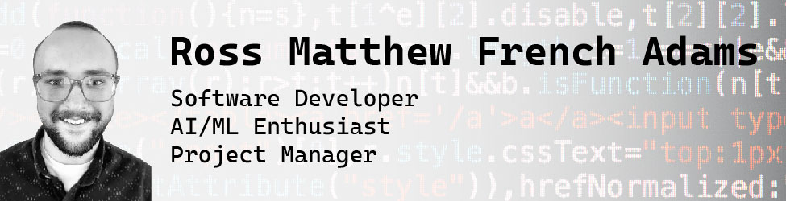

# Hi, I'm Ross 👋

I am a recent graduate in Computer Science with an emphasis on Artificial Intelligence and Machine Learning. I have a background in Operations and Project Management.

## Skills
C++ | Python | Java | R | MySQL

- 🔭 I’m currently working on a Client-Server Java Application for solving Sudoku with OpenCV and DeepLearning4J 
- 🌱 I’m currently learning Julia 
- 📫 How to reach me: rossmfadams@gmail.com 

## Presentations

