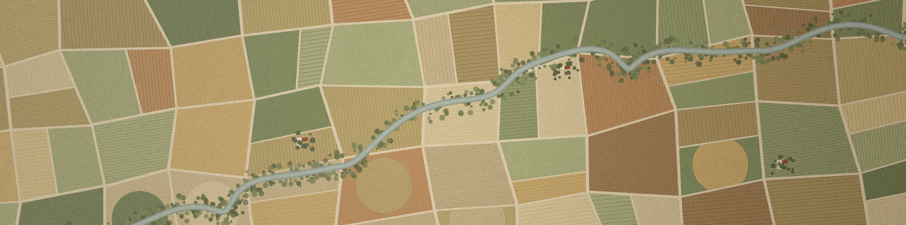

# Hi, I'm Ross 👋

I'm a Data Engineer in Brooklyn, NY. For the past 4+ years I've built production ML pipelines on AWS for autonomous agricultural equipment. Those pipelines have processed 70M+ images and labels to train 4 computer vision models, and I co-maintain a 40-pipeline Airflow platform that supports continual learning. I also build full-stack internal tools and MLOps infrastructure.

## 🔭 Currently building: [Helios](https://github.com/rossmfadams/solar-agent)
Helios is an AI agent for early-stage site diligence on utility-scale solar projects in New York State. You give it an address and, in under 90 seconds, it writes a cited viability memo with a 0–100 Viability Score and an interactive map. The memo covers:

- Interconnection: proximity to transmission lines and substations (HIFLD), plus congestion in the NYISO queue
- Environmental constraints: flood zones (FEMA), wetlands (NWI), protected lands (PAD-US), and parcel slope (USGS 3DEP)
- Permitting: the town's solar zoning ordinance and whether a moratorium is in place

Built with FastAPI, PostgreSQL/PostGIS, LangGraph and Claude.

## Skills
**Languages:** Python | SQL | TypeScript  
**Data & ML:** Airflow | Apache Iceberg | lakeFS | MLflow | PostgreSQL | PyTorch | OpenCV | FiftyOne  
**Cloud & Infra:** AWS | Terraform | Docker | Kubernetes | CI/CD  
**AI Tooling:** Claude Code | LangGraph

## 📫 Reach me
rossmfadams@gmail.com · [linkedin.com/in/rossmfadams](https://linkedin.com/in/rossmfadams)

